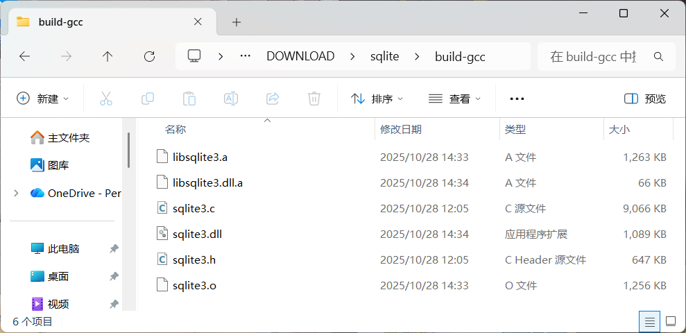
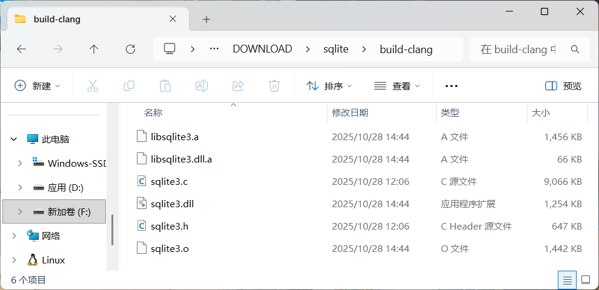

### GCC:clang,如果未来是你的，那就证明给我看
##### If the future is yours,prove it.
##### 미래를 원한다면 증명하세요
---
前几天写C代码实在是对C/C++插件的代码补全速度难绷。
微软官方的插件提示速度慢已经是诟病已久的问题，
所以我放弃了，改用clangd插件。
clangd是LLVM项目的语言服务器，几个月前体验了一会，提示速度很快。
但是不知道怎么配置clangd相关文件，于是很快就放弃了。
那个时候我就在想：clangd一定需要配合自家的LLVM工具链才能最大化发挥它的功能。

如今我找到了llvm-mingw这个项目，个人感觉这套工具融合了LLVM和MinGW两个工具链。
当你运行其bin目录下的gcc或g++，终端信息显示其不是GNU的工具，而是clang；
当你运行其bin目录下的mingw32-make，终端信息又显示其是GNU的make。
我想如果要在Windows下使用LLVM的工具链开发，llvm-mingw是个不二之选。

目前我还在探索这套工具和gcc相比有什么不同之处，
正好最近想着交叉编译sqlite到开发板上用，就试着比较这两个工具链。
[官网](https://www.sqlite.org/download.html)下载sqlite3的Windows平台源码
我编译用的是带配置脚本的[sqlite-autoconf-3500400.tar.gz](https://www.sqlite.org/2025/sqlite-autoconf-3500400.tar.gz)，虽然脚本没用上，
理论上单纯下载聚合源码也行[sqlite-amalgamation-3500400.zip](https://www.sqlite.org/2025/sqlite-amalgamation-3500400.zip)。
在源码目录下各执行以下PowerShell脚本，比较两者的编译速度和库文件产物的大小
```powershell
#gcc构建.ps1
gcc -fPIC -c sqlite3.c -o sqlite3.o -O2 -DSQLITE_ENABLE_FT34 -DSQLITE_ENABLE_RTREE -DSQLITE_ENABLE_COLUMN_METADATA
echo '编译完成'
pause
D:\DEV\w64devkit\bin\ar.exe -rcsv libsqlite3.a sqlite3.o
echo '已链接成静态库'
pause
gcc -shared sqlite3.o -o sqlite3.dll "-Wl,--out-implib=libsqlite3.dll.a"
echo '已链接成动态库'
pause
```
```powershell
#clang构建.ps1
clang -fPIC -c sqlite3.c -o sqlite3.o -O2 -DSQLITE_ENABLE_FT34 -DSQLITE_ENABLE_RTREE -DSQLITE_ENABLE_COLUMN_METADATA
echo '编译完成'
pause
ar -rcsv libsqlite3.a sqlite3.o
echo '已链接成静态库'
pause
clang -shared sqlite3.o -o sqlite3.dll "-Wl,--out-implib=libsqlite3.dll.a"
echo '已链接成动态库'
pause
```
产物如下

<table>
  <tr>
    <td></td>
    <td></td>
  </tr>
</table>

只看编译速度，同样的编译指令下，能明显感觉clang比gcc快很多；
但如果不看编译速度，gcc链接生成的静态库动态库的大小更小。
也就是说gcc牺牲了编译速度换来了更小的存储占用。
